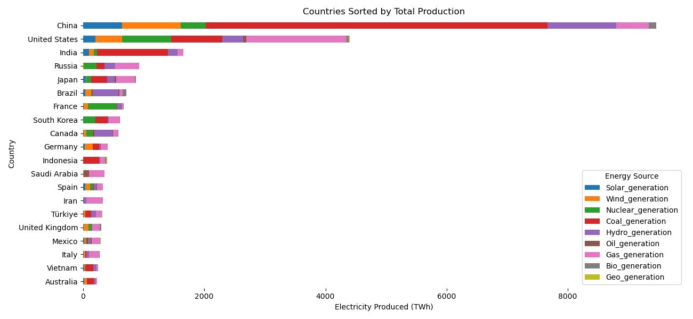
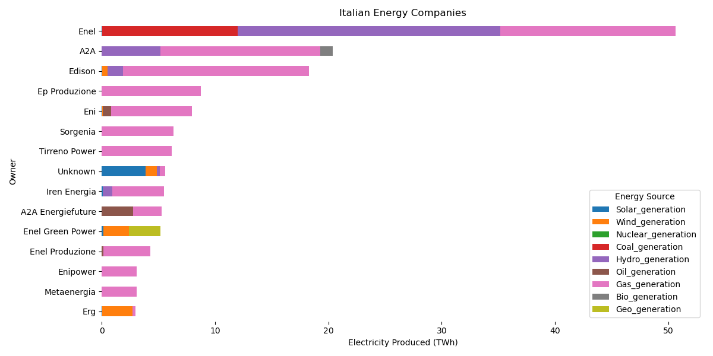

# Nordea-case-ATA
Case study for Nordea - Analytics to Action course

Case study for Nordea.
The team focused on Analyzing the global energy market from a geopolitical standpoint,
highlighting vulnerabilities in energy production.

Observed Italy's heavy reliance on gas from Algeria and poor development of sustainable energy production.

Further studied the composition of Italian energy producers and their energy production means.

Calculations were based on capacity factors drawn from multiple sources on average capacity factors for diifferent regions and energy production methods.

